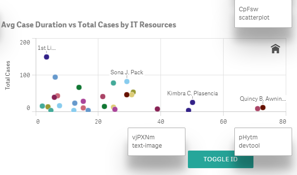
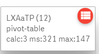
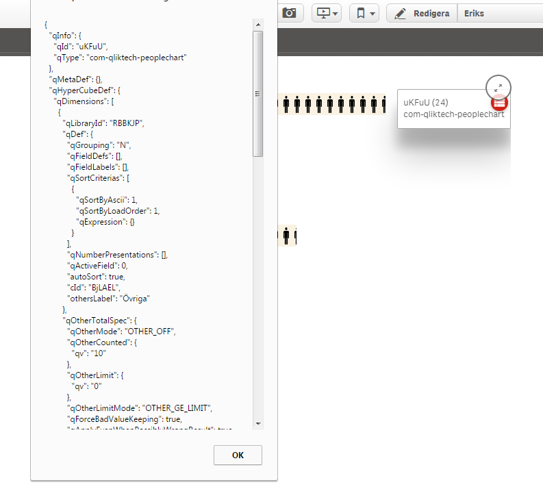

# Qlik Sense Dev tool
Developer tool extension for Qlik Sense

##Allows the user to display id, type, handle and properties for visualizations.

This extension adds a floating action button to your Qlik Sense app. When you press the button it will add labels with id, type and handle to all visualizations on the sheet. The labels also contains buttons to display properties for the visualizations. And from version 3 they also containg some data on calculations and calculation times.

This can be useful if you for example are creating a mashup and need the object ids or for troubleshooting your extension.

###News in Version 3
Calculation data: The extension now also shows some data on calculations:
 

calc: number of calculations performed
ms: total number of milliseconds waiting for calculations
max: longest time for a calculation

###News in Version 2

1. Floating action button
The button is now a FAB button, which will remain on screen until you refresh the page, even if you change sheet.
This means you can use it on a published sheet:
  * create a new sheet
  * add the devtool extension to the new sheet, the button will appear
  * change to the (possibly published) sheet where you need it
  * click the FAB

2. Button to show properties
The labels now also contain a button to show properties for the visualization.

In the future I intend to add more functions to this tool. If you have any ideas, 
please post them, or clone the repository, add it and make a pull request.

Note: this function uses css class names to find the visualizations, angular scope() function to find the corresponding scope and some scope navigation to find the data. This works right now, but might break any time.
